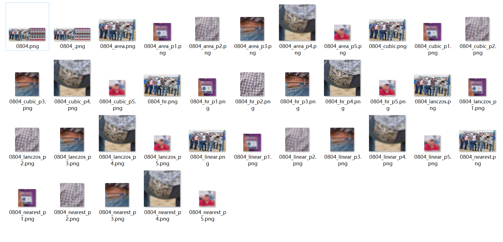

# SR Viewer
This is a simple toolkit to view and crop image patches for image/video super-resolution tasks. In image/video super-resolution, the authors usually need to show the full image and its zoom-in regions for better visualization like the figure shown below.


## Dependencies
* python 3.X (recommend to use [Anaconda](https://www.anaconda.com/))
* opencv-python

## Configurations
```python
result_names = ['hr', 'nearest', 'linear', 'area', 'cubic', 'lanczos'] # name of each methods
result_paths = ['results/hr', 'results/nearest', 'results/linear', 'results/area', 'results/cubic', 'results/lanczos'] # result path of each methods
main_index = 0 # index of the main figure (defalut: HR)
crop_num = 4 # number of crop regions
row_num = 1 # number of rows to show the crop regions.
col_num = math.ceil(len(result_names) / row_num) # number of columns to show the crop regions.

aspect_ratio = 0 # pre-process the image with a given aspect ratio (width / height), 0 for keeping the original aspect ratio.
crop_thickness = 2 # crop box thickness
crop_colors = [(0, 0, 255), (0, 255, 0), (255, 0, 0), (0, 255, 255), (255, 0, 255), (255, 255, 0)]  # crop box colors
pad_size = 3 # pad size
pad_color = (0, 0, 0) # pad colors
mask_size = 40 # image/method name mask size (height)
font_size = 35 # image/method name mask font size
```

## Usages
Setup all the configurations and run the script, you will see a window like this:
   


The user can interact with the toolkit through following interactions:

| User Input  | Action |
| ------------- | ------------- |
| Mouse move  | select crop region  |
| Mouse wheel up  | zoom-out crop region  |
| Mouse wheel down  | zoom-in crop region  |
| Keyboard `a`  | switch to previous image  |
| Keyboard `d`  | switch to next image  |
| Keyboard `s`  | save current crop and move to the next |
| Keyboard `r`  | reset all crop regions for current image  |
| Keyboard `q`  | quit |

The cropped resutls will be saved in the `crops/[image_path]_[datetime]` folder:



## Contact
If you meet any problems when using this toolkit, please feel free to raise an issue.
